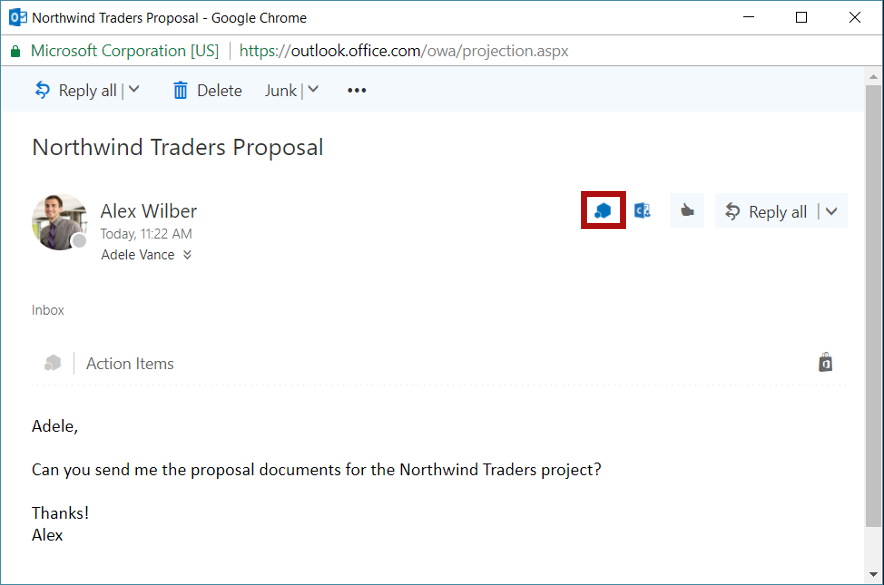

# Do Something

## Emma Sampugnaro, Bill Tang, Jason Wei, Linda Xiao

April 2018

HackDartmouthIV

First:

`npm install -g yo generator-office`

To run:

cd to event_parser directory
then 
`npm start`

[To sideload add-in](https://docs.microsoft.com/en-us/outlook/add-ins/sideload-outlook-add-ins-for-testing)

Now, go to Outlook and click on an email. Locate the add in on the upper right corner.

It should reveal the user interface of the add-in. 

